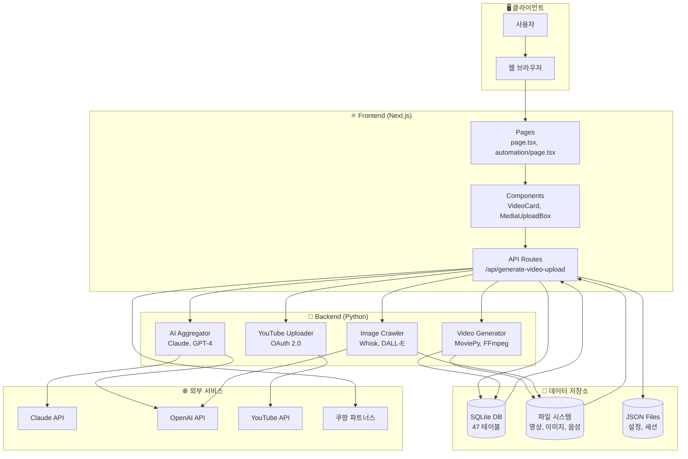

# 시스템 아키텍처 개요

> 🤖 자동 생성됨: 2025. 12. 2. 오후 12:50:33

---

## 📁 프로젝트 구조

```
workspace/
├── trend-video-frontend/    # Next.js 프론트엔드
│   ├── src/app/             # 페이지 & API 라우트
│   ├── src/components/      # React 컴포넌트
│   ├── src/lib/             # 유틸리티 & DB
│   └── data/                # SQLite DB & JSON
├── trend-video-backend/     # Python 백엔드
│   ├── src/video_generator/ # 영상 생성
│   ├── src/ai_aggregator/   # AI 통합
│   └── src/image_crawler/   # 이미지 수집
└── scripts/                 # 유틸리티 스크립트
```

## 🏗️ 기술 스택

### Frontend
- **Framework**: Next.js 15 (App Router)
- **UI**: React 18, TailwindCSS
- **State**: React Hooks
- **Toast**: react-hot-toast

### Backend
- **Language**: Python 3.11+
- **Video**: MoviePy, FFmpeg
- **TTS**: Edge-TTS
- **AI**: Claude API, OpenAI API

### Database
- **SQLite**: 구조화된 데이터 (47개 테이블)
- **JSON Files**: 설정 및 간단한 데이터

## 🔄 시스템 아키텍처 다이어그램



## 📊 주요 테이블 관계

- **users** ← sessions, jobs, scripts, credit_history
- **jobs** ← job_logs, youtube_uploads
- **scripts** ← script_logs
- **unified_queue** → automation_pipelines → automation_logs
- **video_titles** → video_schedules → unified_queue

## 🔐 보안

- 세션 기반 인증 (Cookie)
- 비밀번호 SHA256 해싱
- YouTube OAuth 2.0
- API 키 환경변수 관리

---

*Last Updated: 2025. 12. 2. 오후 12:50:33*
