# 데이터베이스 ERD (Entity Relationship Diagram)

> 🤖 자동 생성됨: 2025. 12. 2. 오후 12:50:33
> 📊 총 24개 테이블

---

## 🗺️ 전체 ERD

```mermaid
erDiagram
    CONTENT ||--o{ CONTENT_SETTING : "has many"
    USER ||--o{ COUPANG_PRODUCT : "has many"
    USER ||--o{ PRODUCT_CRAWL_LINK : "has many"
    USER ||--o{ PRODUCT_CRAWL_LINK_HISTORY : "has many"
    USER ||--o{ PRODUCT_CRAWL_LINK_PENDING : "has many"
    USER ||--o{ USER_ACTIVITY_LOG : "has many"
    USER ||--o{ USER_CATEGORY : "has many"
    USER ||--o{ USER_CHARGE_REQUEST : "has many"
    USER ||--o{ USER_CREDIT_HISTORY : "has many"
    USER ||--o{ USER_SESSION : "has many"
    USER ||--o{ USER_SOCIAL_MEDIA_ACCOUNT : "has many"

    AUTOMATION_LOG {
        TEXT log_id PK
        TEXT user_id NOT NULL
        TEXT channel_id NOT NULL
        TEXT channel_name NOT NULL
        TEXT category NOT NULL
        TEXT status
        TEXT step
        TEXT models_used
        TEXT titles_generated
        TEXT best_title
        REAL best_score
        TEXT result_title_id
        TEXT product_info
        TEXT error_message
        DATETIME created_at
        DATETIME completed_at
        TEXT title_id
        TEXT level
        TEXT details
    }

    AUTOMATION_SETTING {
        TEXT key PK
        TEXT value NOT NULL
        TEXT description
        DATETIME updated_at
    }

    CONTENT {
        TEXT content_id PK
        TEXT user_id NOT NULL
        TEXT title NOT NULL
        TEXT original_title
        TEXT status
        TEXT error
        TEXT youtube_url
        INTEGER input_tokens
        INTEGER output_tokens
        TEXT source_content_id
        TEXT ai_model
        TEXT prompt_format
        TEXT product_info
        TEXT category
        TEXT created_at
        TEXT updated_at
        TEXT converted_from_job_id
        INTEGER score
        TEXT youtube_channel
        DATETIME youtube_publish_time
    }

    CONTENT_SETTING {
        TEXT content_id PK
        TEXT script_mode
        TEXT media_mode
        TEXT tts_voice
        TEXT tts_speed
        INTEGER auto_create_shortform
        TEXT tags
        TEXT settings
        DATETIME created_at
        DATETIME updated_at
        TEXT youtube_privacy
    }

    COUPANG_CRAWL_QUEUE {
        TEXT queue_id PK
        TEXT user_id NOT NULL
        TEXT product_url NOT NULL
        TEXT status
        INTEGER retry_count
        INTEGER max_retries
        INTEGER timeout_seconds
        TEXT error_message
        TEXT product_info
        TEXT custom_category
        TEXT created_at
        TEXT updated_at
        TEXT processed_at
        TEXT destination
        TEXT source_url
    }

    COUPANG_PRODUCT {
        TEXT coupang_id PK
        TEXT user_id NOT NULL
        TEXT product_url NOT NULL
        TEXT deep_link
        TEXT title NOT NULL
        TEXT description
        TEXT category NOT NULL
        REAL original_price
        REAL discount_price
        TEXT image_url
        TEXT status
        INTEGER view_count
        INTEGER click_count
        INTEGER is_favorite
        TEXT created_at
        TEXT updated_at
        TEXT queue_id
    }

    PRODUCT_CRAWL_LINK {
        TEXT link_id PK
        TEXT user_id NOT NULL
        TEXT product_url NOT NULL
        TEXT source_url NOT NULL
        TEXT title
        TEXT description
        TEXT category
        TEXT image_url
        REAL original_price
        REAL discount_price
        TEXT created_at
    }

    PRODUCT_CRAWL_LINK_HISTORY {
        TEXT history_id PK
        TEXT user_id NOT NULL
        TEXT source_url NOT NULL
        TEXT hostname
        INTEGER last_result_count
        INTEGER last_duplicate_count
        INTEGER last_error_count
        INTEGER last_total_links
        TEXT last_status
        TEXT last_message
        TEXT last_job_id
        TEXT last_crawled_at
        TEXT created_at
        TEXT updated_at
    }

    PRODUCT_CRAWL_LINK_PENDING {
        TEXT pending_id PK
        TEXT user_id NOT NULL
        TEXT product_url NOT NULL
        TEXT source_url NOT NULL
        TEXT title
        TEXT status
        TEXT created_at
    }

    TASK {
        TEXT task_id PK
        TEXT status
        DATETIME created_at
        DATETIME updated_at
        TEXT user_id
    }

    TASK_LOCK {
        TEXT task_type PK
        TEXT locked_by
        TEXT locked_at
        INTEGER worker_pid
    }

    TASK_QUEUE {
        TEXT task_id PK
        TEXT type NOT NULL
        TEXT status NOT NULL
        TEXT created_at NOT NULL
        TEXT started_at
        TEXT completed_at
        TEXT user_id NOT NULL
        TEXT error
        INTEGER elapsed_time
        TEXT script_completed_at
        TEXT image_completed_at
        TEXT video_completed_at
        TEXT youtube_completed_at
    }

    TASK_SCHEDULE {
        TEXT schedule_id PK
        TEXT task_id
        DATETIME scheduled_time NOT NULL
        TEXT status
        DATETIME created_at
        DATETIME updated_at
        TEXT shortform_task_id
        TEXT error_message
    }

    TITLE_POOL {
        TEXT title_id PK
        TEXT category NOT NULL
        TEXT title NOT NULL
        INTEGER score NOT NULL
        INTEGER validated
        INTEGER used
        DATETIME created_at
        TEXT ai_model
    }

    USER {
        TEXT user_id PK
        TEXT email NOT NULL
        TEXT password NOT NULL
        TEXT nickname
        INTEGER is_admin
        INTEGER credits
        INTEGER is_email_verified
        TEXT verification_token
        TEXT memo
        TEXT google_sites_url
        TEXT google_sites_edit_url
        TEXT google_sites_home_url
        TEXT created_at
        TEXT updated_at
    }

    USER_ACTIVITY_LOG {
        INTEGER activity_id PK
        TEXT user_id NOT NULL
        TEXT action NOT NULL
        TEXT details
        TEXT created_at
    }

    USER_CATEGORY {
        INTEGER id PK
        TEXT user_id NOT NULL
        TEXT category NOT NULL
        TEXT display_name NOT NULL
        TEXT keywords
        TEXT description
        BOOLEAN is_default
        DATETIME created_at
        DATETIME updated_at
    }

    USER_CHARGE_REQUEST {
        TEXT request_id PK
        TEXT user_id NOT NULL
        INTEGER amount NOT NULL
        TEXT status
        TEXT created_at
        TEXT processed_at
    }

    USER_CONTENT_CATEGORY {
        TEXT category_id PK
        TEXT user_id NOT NULL
        TEXT name NOT NULL
        TEXT description
        DATETIME created_at
    }

    USER_CREDIT_HISTORY {
        TEXT history_id PK
        TEXT user_id NOT NULL
        INTEGER amount NOT NULL
        TEXT type NOT NULL
        TEXT description
        INTEGER balance_after NOT NULL
        TEXT created_at
    }

    USER_SESSION {
        TEXT session_id PK
        TEXT user_id NOT NULL
        TEXT expires_at NOT NULL
        TEXT created_at
    }

    USER_SOCIAL_MEDIA_ACCOUNT {
        TEXT id PK
        TEXT user_id NOT NULL
        TEXT platform NOT NULL
        TEXT account_id NOT NULL
        TEXT username
        TEXT display_name
        TEXT profile_picture
        INTEGER follower_count
        TEXT access_token
        TEXT refresh_token
        TEXT token_expires_at
        INTEGER is_default
        TEXT created_at
        TEXT updated_at
    }

    YOUTUBE_CHANNEL_SETTING {
        TEXT setting_id PK
        TEXT user_id NOT NULL
        TEXT channel_id NOT NULL
        TEXT channel_name NOT NULL
        TEXT color
        TEXT posting_mode
        INTEGER interval_value
        TEXT interval_unit
        TEXT weekday_times
        TEXT categories
        INTEGER is_active
        DATETIME created_at
        DATETIME updated_at
        TEXT posting_times
        TEXT default_time
    }

    YOUTUBE_UPLOADS {
        TEXT id PK
        TEXT content_id
        TEXT task_id
        TEXT channel_id
        TEXT youtube_url NOT NULL
        TEXT youtube_video_id
        TEXT status
        TEXT uploaded_at
        TEXT created_at
    }

```

---

## 📊 테이블 목록

**총 24개 테이블**

### 자동화 (3개)
- **automation_log** (19개 컬럼)
- **automation_setting** (4개 컬럼)
- **title_pool** (8개 컬럼)

### 쿠팡 & 쇼핑 (2개)
- **coupang_crawl_queue** (15개 컬럼)
- **coupang_product** (17개 컬럼)

### 소셜미디어 (2개)
- **youtube_channel_setting** (15개 컬럼)
- **youtube_uploads** (9개 컬럼)

### 로그 & 통계 (1개)
- **user_activity_log** (5개 컬럼)

### 기타 (16개)
- **content** (20개 컬럼)
- **content_setting** (11개 컬럼)
- **product_crawl_link** (11개 컬럼)
- **product_crawl_link_history** (14개 컬럼)
- **product_crawl_link_pending** (7개 컬럼)
- **task** (5개 컬럼)
- **task_lock** (4개 컬럼)
- **task_queue** (13개 컬럼)
- **task_schedule** (8개 컬럼)
- **user** (14개 컬럼)
- **user_category** (9개 컬럼)
- **user_charge_request** (6개 컬럼)
- **user_content_category** (5개 컬럼)
- **user_credit_history** (7개 컬럼)
- **user_session** (4개 컬럼)
- **user_social_media_account** (14개 컬럼)

---

## 📋 테이블 상세 스키마

### automation_log

**컬럼:**

| 컬럼명 | 타입 | 제약 | 설명 |
|--------|------|------|------|
| log_id | TEXT | PK | |
| user_id | TEXT | NOT NULL | |
| channel_id | TEXT | NOT NULL | |
| channel_name | TEXT | NOT NULL | |
| category | TEXT | NOT NULL | |
| status | TEXT | DEFAULT 'started' | |
| step | TEXT | - | |
| models_used | TEXT | - | |
| titles_generated | TEXT | - | |
| best_title | TEXT | - | |
| best_score | REAL | - | |
| result_title_id | TEXT | - | |
| product_info | TEXT | - | |
| error_message | TEXT | - | |
| created_at | DATETIME | DEFAULT CURRENT_TIMESTAMP | |
| completed_at | DATETIME | - | |
| title_id | TEXT | - | |
| level | TEXT | DEFAULT 'info' | |
| details | TEXT | - | |

**인덱스:**

- idx_automation_logs_user_status
- idx_automation_logs_created

---

### automation_setting

**컬럼:**

| 컬럼명 | 타입 | 제약 | 설명 |
|--------|------|------|------|
| key | TEXT | PK | |
| value | TEXT | NOT NULL | |
| description | TEXT | - | |
| updated_at | DATETIME | DEFAULT CURRENT_TIMESTAMP | |

---

### content

**컬럼:**

| 컬럼명 | 타입 | 제약 | 설명 |
|--------|------|------|------|
| content_id | TEXT | PK | |
| user_id | TEXT | NOT NULL | |
| title | TEXT | NOT NULL | |
| original_title | TEXT | - | |
| status | TEXT | DEFAULT 'pending' | |
| error | TEXT | - | |
| youtube_url | TEXT | - | |
| input_tokens | INTEGER | - | |
| output_tokens | INTEGER | - | |
| source_content_id | TEXT | - | |
| ai_model | TEXT | - | |
| prompt_format | TEXT | - | |
| product_info | TEXT | - | |
| category | TEXT | - | |
| created_at | TEXT | - | |
| updated_at | TEXT | - | |
| converted_from_job_id | TEXT | - | |
| score | INTEGER | DEFAULT NULL | |
| youtube_channel | TEXT | - | |
| youtube_publish_time | DATETIME | - | |

**인덱스:**

- idx_content_content_id
- idx_content_user_id
- idx_content_status

---

### content_setting

**컬럼:**

| 컬럼명 | 타입 | 제약 | 설명 |
|--------|------|------|------|
| content_id | TEXT | PK | |
| script_mode | TEXT | DEFAULT 'chrome' | |
| media_mode | TEXT | DEFAULT 'crawl' | |
| tts_voice | TEXT | DEFAULT 'ko-KR-SoonBokNeural' | |
| tts_speed | TEXT | DEFAULT '+0%' | |
| auto_create_shortform | INTEGER | DEFAULT 1 | |
| tags | TEXT | - | |
| settings | TEXT | - | |
| created_at | DATETIME | DEFAULT CURRENT_TIMESTAMP | |
| updated_at | DATETIME | DEFAULT CURRENT_TIMESTAMP | |
| youtube_privacy | TEXT | DEFAULT 'public' | |

**외래키:**

- content_id → content(content_id)

---

### coupang_crawl_queue

**컬럼:**

| 컬럼명 | 타입 | 제약 | 설명 |
|--------|------|------|------|
| queue_id | TEXT | PK | |
| user_id | TEXT | NOT NULL | |
| product_url | TEXT | NOT NULL | |
| status | TEXT | DEFAULT 'pending' | |
| retry_count | INTEGER | DEFAULT 0 | |
| max_retries | INTEGER | DEFAULT 3 | |
| timeout_seconds | INTEGER | DEFAULT 60 | |
| error_message | TEXT | - | |
| product_info | TEXT | - | |
| custom_category | TEXT | - | |
| created_at | TEXT | DEFAULT datetime('now') | |
| updated_at | TEXT | DEFAULT datetime('now') | |
| processed_at | TEXT | - | |
| destination | TEXT | DEFAULT 'my_list' | |
| source_url | TEXT | - | |

**인덱스:**

- idx_coupang_crawl_queue_user_id
- idx_coupang_crawl_queue_status

---

### coupang_product

**컬럼:**

| 컬럼명 | 타입 | 제약 | 설명 |
|--------|------|------|------|
| coupang_id | TEXT | PK | |
| user_id | TEXT | NOT NULL | |
| product_url | TEXT | NOT NULL | |
| deep_link | TEXT | - | |
| title | TEXT | NOT NULL | |
| description | TEXT | - | |
| category | TEXT | NOT NULL | |
| original_price | REAL | - | |
| discount_price | REAL | - | |
| image_url | TEXT | - | |
| status | TEXT | DEFAULT 'active' | |
| view_count | INTEGER | DEFAULT 0 | |
| click_count | INTEGER | DEFAULT 0 | |
| is_favorite | INTEGER | DEFAULT 0 | |
| created_at | TEXT | DEFAULT datetime('now') | |
| updated_at | TEXT | DEFAULT datetime('now') | |
| queue_id | TEXT | - | |

**외래키:**

- user_id → user(user_id)

**인덱스:**

- idx_coupang_product_user_id

---

### product_crawl_link

**컬럼:**

| 컬럼명 | 타입 | 제약 | 설명 |
|--------|------|------|------|
| link_id | TEXT | PK | |
| user_id | TEXT | NOT NULL | |
| product_url | TEXT | NOT NULL | |
| source_url | TEXT | NOT NULL | |
| title | TEXT | - | |
| description | TEXT | - | |
| category | TEXT | - | |
| image_url | TEXT | - | |
| original_price | REAL | - | |
| discount_price | REAL | - | |
| created_at | TEXT | DEFAULT datetime('now') | |

**외래키:**

- user_id → user(user_id)

**인덱스:**

- idx_product_crawl_link_user_id

---

### product_crawl_link_history

**컬럼:**

| 컬럼명 | 타입 | 제약 | 설명 |
|--------|------|------|------|
| history_id | TEXT | PK | |
| user_id | TEXT | NOT NULL | |
| source_url | TEXT | NOT NULL | |
| hostname | TEXT | - | |
| last_result_count | INTEGER | DEFAULT 0 | |
| last_duplicate_count | INTEGER | DEFAULT 0 | |
| last_error_count | INTEGER | DEFAULT 0 | |
| last_total_links | INTEGER | DEFAULT 0 | |
| last_status | TEXT | DEFAULT 'pending' | |
| last_message | TEXT | - | |
| last_job_id | TEXT | - | |
| last_crawled_at | TEXT | DEFAULT datetime('now') | |
| created_at | TEXT | DEFAULT datetime('now') | |
| updated_at | TEXT | DEFAULT datetime('now') | |

**외래키:**

- user_id → user(user_id)

**인덱스:**

- idx_product_crawl_link_history_user_id

---

### product_crawl_link_pending

**컬럼:**

| 컬럼명 | 타입 | 제약 | 설명 |
|--------|------|------|------|
| pending_id | TEXT | PK | |
| user_id | TEXT | NOT NULL | |
| product_url | TEXT | NOT NULL | |
| source_url | TEXT | NOT NULL | |
| title | TEXT | - | |
| status | TEXT | DEFAULT 'pending' | |
| created_at | TEXT | DEFAULT datetime('now') | |

**외래키:**

- user_id → user(user_id)

**인덱스:**

- idx_product_crawl_link_pending_user_id

---

### task

**컬럼:**

| 컬럼명 | 타입 | 제약 | 설명 |
|--------|------|------|------|
| task_id | TEXT | PK | |
| status | TEXT | DEFAULT 'draft' | |
| created_at | DATETIME | DEFAULT CURRENT_TIMESTAMP | |
| updated_at | DATETIME | DEFAULT CURRENT_TIMESTAMP | |
| user_id | TEXT | - | |

**인덱스:**

- idx_task_user_id
- idx_task_status

---

### task_lock

**컬럼:**

| 컬럼명 | 타입 | 제약 | 설명 |
|--------|------|------|------|
| task_type | TEXT | PK | |
| locked_by | TEXT | - | |
| locked_at | TEXT | - | |
| worker_pid | INTEGER | - | |

---

### task_queue

**컬럼:**

| 컬럼명 | 타입 | 제약 | 설명 |
|--------|------|------|------|
| task_id | TEXT | PK | |
| type | TEXT | NOT NULL | |
| status | TEXT | NOT NULL | |
| created_at | TEXT | NOT NULL | |
| started_at | TEXT | - | |
| completed_at | TEXT | - | |
| user_id | TEXT | NOT NULL | |
| error | TEXT | - | |
| elapsed_time | INTEGER | DEFAULT NULL | |
| script_completed_at | TEXT | - | |
| image_completed_at | TEXT | - | |
| video_completed_at | TEXT | - | |
| youtube_completed_at | TEXT | - | |

**인덱스:**

- idx_task_queue_user_status
- idx_task_queue_completed_at
- idx_task_queue_type_status

---

### task_schedule

**컬럼:**

| 컬럼명 | 타입 | 제약 | 설명 |
|--------|------|------|------|
| schedule_id | TEXT | PK | |
| task_id | TEXT | - | |
| scheduled_time | DATETIME | NOT NULL | |
| status | TEXT | DEFAULT 'pending' | |
| created_at | DATETIME | DEFAULT CURRENT_TIMESTAMP | |
| updated_at | DATETIME | DEFAULT CURRENT_TIMESTAMP | |
| shortform_task_id | TEXT | - | |
| error_message | TEXT | - | |

---

### title_pool

**컬럼:**

| 컬럼명 | 타입 | 제약 | 설명 |
|--------|------|------|------|
| title_id | TEXT | PK | |
| category | TEXT | NOT NULL | |
| title | TEXT | NOT NULL | |
| score | INTEGER | NOT NULL | |
| validated | INTEGER | DEFAULT 0 | |
| used | INTEGER | DEFAULT 0 | |
| created_at | DATETIME | DEFAULT CURRENT_TIMESTAMP | |
| ai_model | TEXT | DEFAULT 'claude' | |

**인덱스:**

- idx_title_pool_category_score
- idx_title_pool_category
- idx_title_pool_used
- idx_title_pool_score

---

### user

**컬럼:**

| 컬럼명 | 타입 | 제약 | 설명 |
|--------|------|------|------|
| user_id | TEXT | PK | |
| email | TEXT | NOT NULL | |
| password | TEXT | NOT NULL | |
| nickname | TEXT | - | |
| is_admin | INTEGER | DEFAULT 0 | |
| credits | INTEGER | DEFAULT 0 | |
| is_email_verified | INTEGER | DEFAULT 0 | |
| verification_token | TEXT | - | |
| memo | TEXT | - | |
| google_sites_url | TEXT | - | |
| google_sites_edit_url | TEXT | - | |
| google_sites_home_url | TEXT | - | |
| created_at | TEXT | DEFAULT datetime('now') | |
| updated_at | TEXT | DEFAULT datetime('now') | |

**인덱스:**

- idx_user_email
- idx_user_verification_token

---

### user_activity_log

**컬럼:**

| 컬럼명 | 타입 | 제약 | 설명 |
|--------|------|------|------|
| activity_id | INTEGER | PK | |
| user_id | TEXT | NOT NULL | |
| action | TEXT | NOT NULL | |
| details | TEXT | - | |
| created_at | TEXT | DEFAULT datetime('now') | |

**외래키:**

- user_id → user(user_id)

**인덱스:**

- idx_user_activity_log_user_id

---

### user_category

**컬럼:**

| 컬럼명 | 타입 | 제약 | 설명 |
|--------|------|------|------|
| id | INTEGER | PK | |
| user_id | TEXT | NOT NULL | |
| category | TEXT | NOT NULL | |
| display_name | TEXT | NOT NULL | |
| keywords | TEXT | - | |
| description | TEXT | - | |
| is_default | BOOLEAN | DEFAULT 0 | |
| created_at | DATETIME | DEFAULT CURRENT_TIMESTAMP | |
| updated_at | DATETIME | DEFAULT CURRENT_TIMESTAMP | |

**외래키:**

- user_id → user(user_id)

---

### user_charge_request

**컬럼:**

| 컬럼명 | 타입 | 제약 | 설명 |
|--------|------|------|------|
| request_id | TEXT | PK | |
| user_id | TEXT | NOT NULL | |
| amount | INTEGER | NOT NULL | |
| status | TEXT | DEFAULT 'pending' | |
| created_at | TEXT | DEFAULT datetime('now') | |
| processed_at | TEXT | - | |

**외래키:**

- user_id → user(user_id)

**인덱스:**

- idx_user_charge_request_user_id

---

### user_content_category

**컬럼:**

| 컬럼명 | 타입 | 제약 | 설명 |
|--------|------|------|------|
| category_id | TEXT | PK | |
| user_id | TEXT | NOT NULL | |
| name | TEXT | NOT NULL | |
| description | TEXT | - | |
| created_at | DATETIME | DEFAULT CURRENT_TIMESTAMP | |

**인덱스:**

- idx_user_content_category_user_id

---

### user_credit_history

**컬럼:**

| 컬럼명 | 타입 | 제약 | 설명 |
|--------|------|------|------|
| history_id | TEXT | PK | |
| user_id | TEXT | NOT NULL | |
| amount | INTEGER | NOT NULL | |
| type | TEXT | NOT NULL | |
| description | TEXT | - | |
| balance_after | INTEGER | NOT NULL | |
| created_at | TEXT | DEFAULT datetime('now') | |

**외래키:**

- user_id → user(user_id)

**인덱스:**

- idx_user_credit_history_user_id

---

### user_session

**컬럼:**

| 컬럼명 | 타입 | 제약 | 설명 |
|--------|------|------|------|
| session_id | TEXT | PK | |
| user_id | TEXT | NOT NULL | |
| expires_at | TEXT | NOT NULL | |
| created_at | TEXT | DEFAULT datetime('now') | |

**외래키:**

- user_id → user(user_id)

**인덱스:**

- idx_user_session_user_id

---

### user_social_media_account

**컬럼:**

| 컬럼명 | 타입 | 제약 | 설명 |
|--------|------|------|------|
| id | TEXT | PK | |
| user_id | TEXT | NOT NULL | |
| platform | TEXT | NOT NULL | |
| account_id | TEXT | NOT NULL | |
| username | TEXT | - | |
| display_name | TEXT | - | |
| profile_picture | TEXT | - | |
| follower_count | INTEGER | - | |
| access_token | TEXT | - | |
| refresh_token | TEXT | - | |
| token_expires_at | TEXT | - | |
| is_default | INTEGER | DEFAULT 0 | |
| created_at | TEXT | DEFAULT CURRENT_TIMESTAMP | |
| updated_at | TEXT | DEFAULT CURRENT_TIMESTAMP | |

**외래키:**

- user_id → user(user_id)

**인덱스:**

- idx_user_social_media_account_user_platform

---

### youtube_channel_setting

**컬럼:**

| 컬럼명 | 타입 | 제약 | 설명 |
|--------|------|------|------|
| setting_id | TEXT | PK | |
| user_id | TEXT | NOT NULL | |
| channel_id | TEXT | NOT NULL | |
| channel_name | TEXT | NOT NULL | |
| color | TEXT | DEFAULT '#3b82f6' | |
| posting_mode | TEXT | DEFAULT 'fixed_interval' | |
| interval_value | INTEGER | - | |
| interval_unit | TEXT | - | |
| weekday_times | TEXT | - | |
| categories | TEXT | - | |
| is_active | INTEGER | DEFAULT 1 | |
| created_at | DATETIME | DEFAULT CURRENT_TIMESTAMP | |
| updated_at | DATETIME | DEFAULT CURRENT_TIMESTAMP | |
| posting_times | TEXT | - | |
| default_time | TEXT | DEFAULT '11:00' | |

---

### youtube_uploads

**컬럼:**

| 컬럼명 | 타입 | 제약 | 설명 |
|--------|------|------|------|
| id | TEXT | PK | |
| content_id | TEXT | - | |
| task_id | TEXT | - | |
| channel_id | TEXT | - | |
| youtube_url | TEXT | NOT NULL | |
| youtube_video_id | TEXT | - | |
| status | TEXT | DEFAULT 'active' | |
| uploaded_at | TEXT | DEFAULT CURRENT_TIMESTAMP | |
| created_at | TEXT | DEFAULT CURRENT_TIMESTAMP | |

**인덱스:**

- idx_youtube_uploads_content
- idx_youtube_uploads_task
- idx_youtube_uploads_channel
- idx_youtube_uploads_video_id

---

## 📝 변경 이력

- **마지막 업데이트**: 2025. 12. 2. 오후 12:50:33
- **업데이트 주기**: 매일 새벽 6시 자동
- **테이블 개수**: 24개
