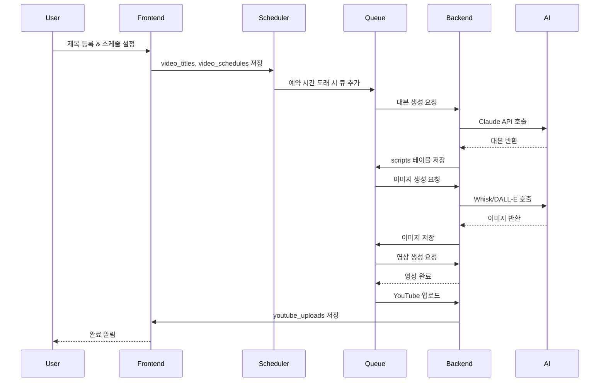
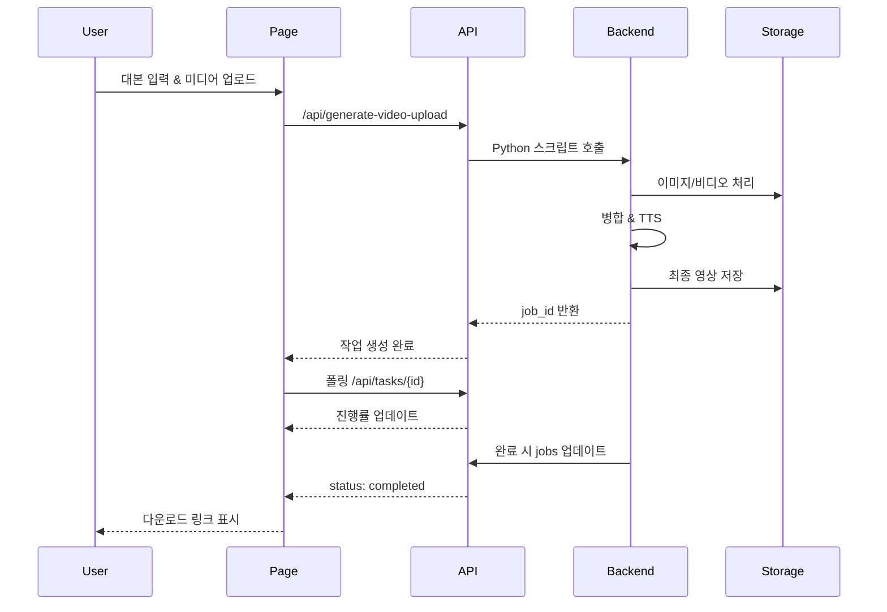
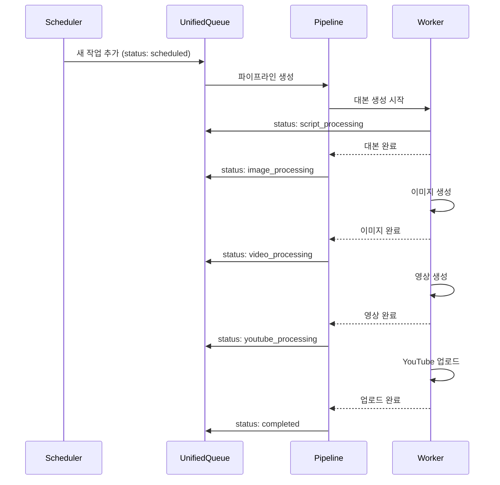
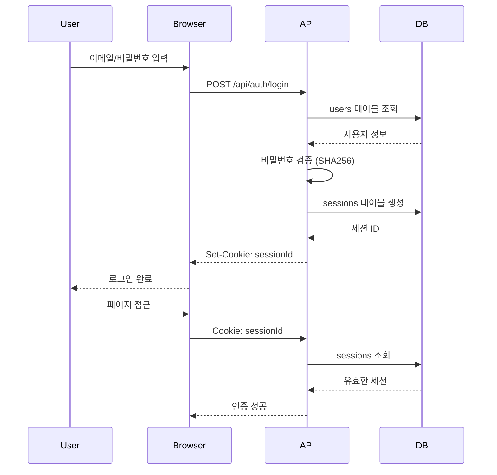
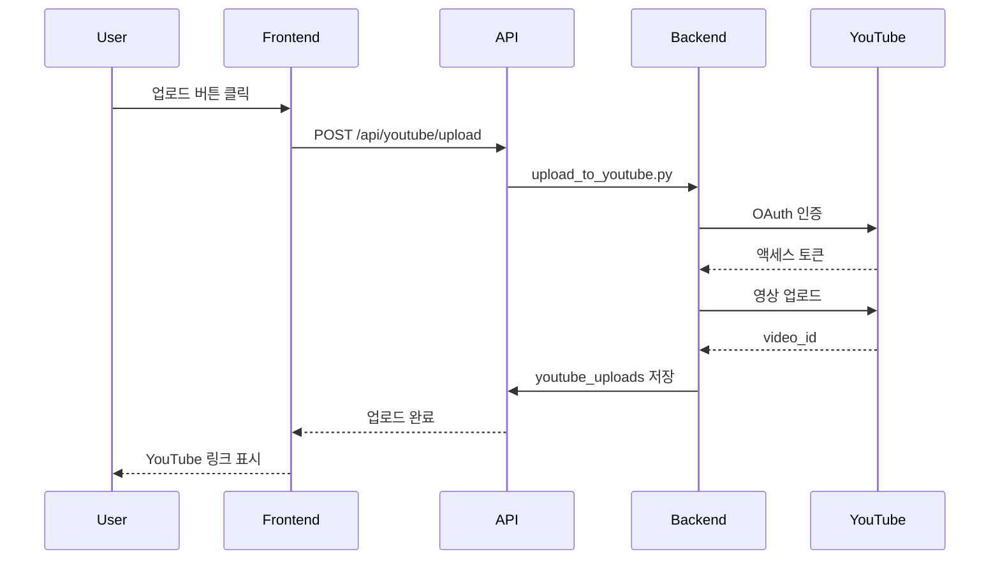

# 시스템 시퀀스 다이어그램

> 🤖 자동 생성됨: 2025. 12. 2. 오후 12:50:33

---

## 1. 자동화 파이프라인 흐름

## 2. 영상 생성 워크플로우

## 3. 큐 시스템 처리

## 4. 사용자 인증 흐름

## 5. YouTube 업로드 흐름

---

*Last Updated: 2025. 12. 2. 오후 12:50:33*
